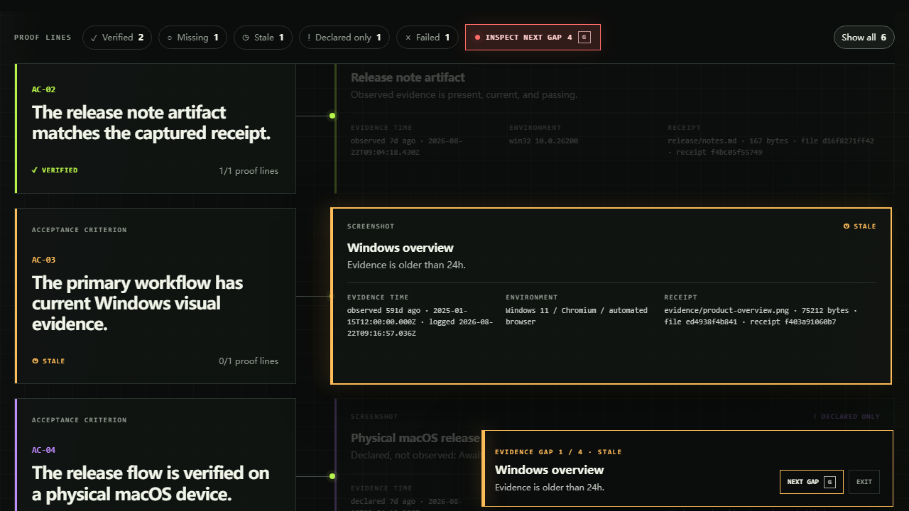

# Codex Proofline

**Proof, not promises.** Turn every acceptance criterion into a visible line to the command, file, screenshot, environment, and timestamp that supports it.



> **Signature interaction — Gap Tour.** Choose **Inspect next gap** (or press `G`) to traverse the actual non-verified proof lines and read each stored status and reason. Nothing turns green during inspection. See the [Forensic Oscilloscope design direction](docs/design-system.md).

> **Goal Delta — when the contract moves.** Compare two named goal/acceptance revisions, propagate impact only through explicit evidence dependencies, and see which old receipts remain usable, which become `stale`, why, and what to observe next. The self-contained report uses a revision redline, a contract fault, and an evidence shockwave instead of a generic JSON diff.

Agents often say “done” while the user still has to reconstruct the contract, rerun tests, find screenshots, and remember which platform was actually checked. Proofline makes that reconstruction a product surface.

It is an **Execution-after proof layer**. It does not plan work, schedule agents, replace CI, or infer proof from assistant prose. Codex Flightplan answers “what should happen before execution?” Proofline answers “what was actually observed after execution, and is that evidence still usable?”

## See the value in one minute

Requirements: Node.js 20 or newer. The core has no runtime dependencies.

Download the source ZIP or installable TGZ from the [v0.1.0 public preview](https://github.com/codex-improvement-lab/codex-proofline/releases/tag/v0.1.0). The source ZIP includes the development checks; both archives include the offline example reports. This release is distributed through GitHub Releases.

Install the downloaded TGZ to use `proofline` from any project:

```sh
npm install --global ./codex-proofline-0.1.0.tgz
proofline version
proofline init
```

To explore without installing, extract the source ZIP and run:

```sh
node ./bin/proofline.js status --manifest ./examples/release-readiness/proofline.json
node ./bin/proofline.js report --manifest ./examples/release-readiness/proofline.json --format html --output ./proofline-report.html --at 2026-09-05T00:00:00.000Z
node ./bin/proofline.js goal-delta --manifest ./examples/goal-delta/checkout-shockwave/proofline.json --from ./examples/goal-delta/checkout-shockwave/contracts/before.json --to ./examples/goal-delta/checkout-shockwave/contracts/after.json --dependencies ./examples/goal-delta/checkout-shockwave/dependencies.json --at 2026-08-30T08:00:00.000Z
node ./bin/proofline.js serve --manifest ./examples/release-readiness/proofline.json
```

Open `http://127.0.0.1:4317`. You can also open the bundled `examples/release-readiness/proofline-report.html` directly without a server. These are synthetic demonstration inputs, not this project's release verdict. The example intentionally shows all five evidence states:

```text
✓ verified        observed, passing, current evidence
○ missing         no receipt exists
◷ stale           too old or changed since capture
! declared only   asserted, but not observed
× failed          observed result violated the contract
```

The first screen answers three questions without reading a log:

1. How many acceptance criteria are actually supported?
2. Which exact proof line blocks readiness?
3. What environment and receipt produced the evidence?

## The complete loop

Initialize a graph:

```sh
proofline init
```

Describe acceptance criteria in `proofline.json`:

```json
{
  "version": 1,
  "project": "Checkout v2",
  "defaultFreshnessHours": 72,
  "completionPolicy": "warn",
  "criteria": [
    {
      "id": "AC-01",
      "statement": "The checkout regression suite passes.",
      "proof": [
        {
          "id": "tests",
          "kind": "command",
          "label": "Checkout tests",
          "environment": "CI / Linux / automated",
          "inputs": ["src/checkout", "test/checkout", "package.json"],
          "freshnessHours": 24,
          "expect": { "exitCode": 0 }
        }
      ]
    },
    {
      "id": "AC-02",
      "statement": "The updated flow has current Windows visual evidence.",
      "proof": [
        {
          "id": "windows-ui",
          "kind": "screenshot",
          "label": "Checkout confirmation",
          "path": "docs/evidence/checkout.png",
          "environment": "Windows 11 / Edge / automated browser",
          "freshnessHours": 168
        }
      ]
    }
  ]
}
```

Execute a command through Proofline so the result is observed rather than merely named:

```sh
proofline run AC-01/tests --environment "CI / Linux / automated" -- npm test
```

Capture a configured file or screenshot. Screenshot labels must exactly match the environment contract in the manifest:

```sh
proofline capture AC-02/windows-ui --environment "Windows 11 / Edge / automated browser"
```

Use `--observed-at <ISO-8601>` only when importing an existing artifact. The receipt keeps both the supplied observation time and the current ledger-write time, so the report can show that distinction.

When external work is asserted but cannot be observed, preserve the boundary instead of turning it green:

```sh
proofline claim AC-03/macos-device --note "Awaiting a physical macOS device run."
```

Inspect and gate:

```sh
proofline status
proofline check
```

`status` always renders the graph. `check` exits nonzero until every acceptance criterion is verified, making it suitable for a release gate.

Generate reviewer-facing artifacts:

```sh
proofline report --format markdown --output proofline-report.md
proofline report --format html --output proofline-report.html
proofline report --format json --output proofline-report.json
```

Markdown is designed for GitHub pull requests and release notes. HTML is a self-contained, offline, filterable proof graph. JSON is the stable automation surface.

## Goal Delta: prove against the contract that actually exists now

Goal Delta answers one narrow question: **after a goal or acceptance contract changes, which old evidence still holds, which is invalid, and why?** It does not infer that two sentences “mean the same thing.” Contract items are paired by stable ID, their `goal` and `acceptance` fields are compared deterministically, and impact travels only through the supplied `dependsOn` lists.

The inputs are deliberately small:

- a prior contract snapshot using `proofline-goal-contract/1`;
- a target contract snapshot with a different explicit `revision`;
- one `proofline-goal-dependencies/1` file that maps every current `criterion/proof` line to contract item IDs.

Generate the visual report and the Workprint public projection together:

```sh
proofline goal-delta \
  --manifest ./examples/goal-delta/checkout-shockwave/proofline.json \
  --from ./examples/goal-delta/checkout-shockwave/contracts/before.json \
  --to ./examples/goal-delta/checkout-shockwave/contracts/after.json \
  --dependencies ./examples/goal-delta/checkout-shockwave/dependencies.json \
  --output ./goal-delta-report.html \
  --profile-output ./goal-delta.workprint.json \
  --at 2026-08-30T08:00:00.000Z
```

`--at` fixes the evaluation clock for byte-reproducible reports. The Workprint file keeps the fixed `workprint-profile/0.1` / `goal-delta` shell, source revisions, one `contract-change` finding per item, affected evidence IDs, and summary counts. It excludes manifest paths, absolute machine paths, receipt internals, and command output.

Contract verdicts are `added`, `removed`, `changed`, and `unchanged`; they are not new evidence states. A previously `verified` receipt on a changed dependency path becomes the existing `stale` state with a reason such as `contract-revision-changed`. An unrelated receipt keeps its evaluated state. Existing `failed`, `missing`, and `declared-only` lines are never promoted by a contract diff.

Three checked-in scenarios cover the signature all-green-to-stale shockwave, strict isolation of unrelated evidence, and added/removed contract items. See [the scenario index](examples/goal-delta/README.md) and open the [signature HTML report](examples/goal-delta/checkout-shockwave/goal-delta-report.html).

## Commands

| Command | Outcome |
| --- | --- |
| `proofline init [directory]` | Create a safe starter manifest without overwriting an existing one. |
| `proofline run <criterion/proof> -- <command>` | Execute a command and append exit code, output digests, duration, environment, and time. |
| `proofline capture <criterion/proof>` | Hash a configured file or screenshot and append an observed receipt. |
| `proofline claim <criterion/proof> --note <text>` | Record an explicit `declared-only` boundary. |
| `proofline status [--json]` | Evaluate the graph without acting as a gate. |
| `proofline check [--json]` | Exit `1` when any acceptance criterion is not verified. |
| `proofline report --format ...` | Generate Markdown, HTML, or JSON. |
| `proofline goal-delta --from ... --to ... --dependencies ...` | Generate a deterministic contract redline, evidence-impact report, and Workprint projection. |
| `proofline serve` | Serve a live local report on `127.0.0.1` by default. |

Pass `--manifest <path>` to any command except `init`. Evidence is appended to `.proofline/evidence.jsonl` beside the manifest unless `ledger` specifies another in-project path.

## What a receipt contains

Command receipts contain:

- the tokenized command;
- exit code and signal;
- duration and stdout/stderr byte counts;
- SHA-256 digests of stdout and stderr, not raw output;
- OS, architecture, Node version, explicit environment label, and timestamp;
- an optional digest over configured `inputs`, so source changes invalidate the receipt immediately;
- a SHA-256 receipt over the complete record.

File and screenshot receipts add the configured relative path, byte size, modification time, and current file digest. During evaluation, Proofline re-hashes the artifact. Changed bytes become `stale`; a modified ledger record becomes `failed`.

When a command or file proof defines `environment`, `run` or `capture` requires the exact explicit label and the evaluator enforces it. When command `inputs` are configured, Proofline recursively fingerprints those relative files/directories before execution and marks the receipt `stale` as soon as they change. Avoid volatile outputs such as the evidence ledger itself. The JSONL ledger is append-only by convention and diff-friendly. The receipt hash is tamper-evident, not a signature.

## Codex plugin

This repository is also a Codex plugin:

- `skills/proofline/SKILL.md` teaches Codex to collect evidence without promoting prose to proof.
- `hooks/hooks.json` provides an optional `Stop` lifecycle check.
- `completionPolicy: "warn"` reports gaps without forcing another turn.
- `completionPolicy: "enforce-once"` asks Codex to continue once when evidence is incomplete, then fails open on the continued stop to avoid loops.
- `completionPolicy: "off"` disables the lifecycle message while leaving the CLI available.

Plugin hooks are not silently trusted. Review the hook definition before enabling it. The CLI remains useful without installing the plugin.

For release validation on macOS, use the [exact real-Mac handoff](docs/MACOS_HANDOFF.md). Its gate pins the transferred source bytes, creates a temporary local marketplace, directly hashes and runs the installed cached copy, then opens a fresh ephemeral Codex task whose Skill helper and `Stop` hook write separate one-time challenge receipts. It verifies cleanup and retains only a path-redacted JSON receipt. The current replacement candidate has not yet run on a Mac; evidence from the superseded candidate is not imported.

Proofline deliberately does not ship an MCP server, MCP Apps component, or App Server client in v0.1. The local proof graph needs neither a service nor model-facing tools; adding them would increase installation and trust cost without completing a missing user loop. See [the extension-surface decision](docs/EXTENSION_SURFACE.md).

## Evidence boundary

Proofline receipts are local and tamper-evident, not cryptographic attestations.

- A passing command proves the recorded process result, not correctness beyond the command's scope.
- A file receipt proves the current bytes match captured bytes.
- A screenshot receipt proves captured bytes, a timestamp, and a declared environment label. It does not independently prove visual correctness, physical-device origin, production state, or real-user validation.
- A Goal Delta finding proves a deterministic ID/field comparison and explicit dependency traversal. It does not prove semantic equivalence, contract quality, or that a rerun will pass the new acceptance target.
- A GitHub Actions result is external runner evidence for its exact commit; it is not an observation of a user's physical device.
- Windows automation, a responsive viewport, or a simulator is not macOS physical-device evidence.

For a host-authenticated completion contract that community code cannot provide, see the [native product proposal](docs/NATIVE_PRODUCT_PROPOSAL.md).

## Platform status

| Surface | Status | Evidence |
| --- | --- | --- |
| Windows 11, build 26200, x64 | **Local automated evidence** | Node v24.19.0 core suite and packaged CLI; 2026-09-05 browser checks cover desktop/390×844, Gap Tour, and Goal Delta. See the [publication evidence](release/PUBLICATION.md). |
| Physical macOS / Codex integration | **Current full gate pending** | The exact prior `9bdf7995…` candidate retains its targeted Lab PASS. The current Goal Delta candidate does not inherit it; the separate full gate-v2 sequence remains pending. |
| GitHub Actions on Windows/macOS | **Six-job release matrix** | Node 20/22/24; lint, tests, demos, release gate, actual npm dry run, and installed package smoke. Consult the [exact observed runs](release/PUBLICATION.md) for the published commit. |
| Real users / production | **Not tested** | Public distribution does not establish adoption, production validation, or an independent user study. |

The generated visual evidence and exact provenance are documented in [docs/evidence/README.md](docs/evidence/README.md).

Proofline also evaluates its own `0.1.0` release candidate. The checked-in [project proof report](PROOFLINE_REPORT.md) is a dated local snapshot. Later external CI and publication observations are recorded separately in the [publication record](release/PUBLICATION.md). The original machine-local ledger stays private; the public examples use synthetic ledgers.

## Develop

```sh
npm install --ignore-scripts
npm run lint
npm test
npm run demo
npm run demo:goal-delta
npm run release:check
npm pack --dry-run
```

With a current Codex CLI installed, `npm run macos:implementation-check` exercises the marketplace lifecycle in an isolated Codex home and labels the result as non-macOS. On a real Mac, follow [docs/MACOS_HANDOFF.md](docs/MACOS_HANDOFF.md) and run `npm run macos:gate` only as part of the complete handoff.

There are no install-time scripts and no runtime dependencies. Tests use Node's built-in test runner and keep temporary fixtures under the repository's ignored `.proofline/tmp/` directory.

Read [CONTRIBUTING.md](CONTRIBUTING.md) before changing evidence semantics. The release checklist is in [RELEASE_CHECKLIST.md](RELEASE_CHECKLIST.md).

## Project notes

- [Product insights](docs/PRODUCT_INSIGHTS.md)
- [Official extension-surface decision](docs/EXTENSION_SURFACE.md)
- [Native Completion Contract proposal](docs/NATIVE_PRODUCT_PROPOSAL.md)
- [Verification record](docs/VERIFICATION.md)
- [Exact macOS readiness handoff](docs/MACOS_HANDOFF.md)
- [Current project proof report](PROOFLINE_REPORT.md)
- [Changelog](CHANGELOG.md)
- [Release notes](RELEASE_NOTES.md)

## License

MIT
